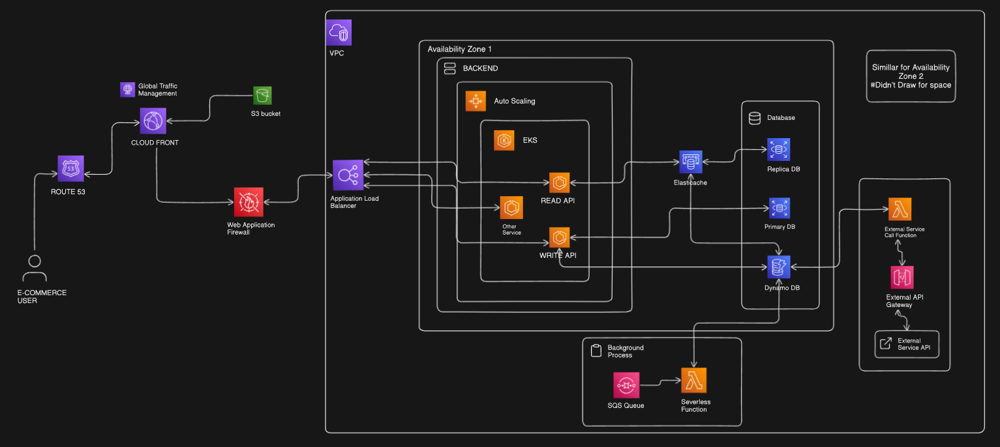

# 🛒 Scalable E-Commerce Cloud Architecture on AWS

This project demonstrates a **highly available**, **scalable**, and **secure** cloud infrastructure architecture for an e-commerce platform, designed using AWS services. The architecture supports microservices, fault tolerance, caching, asynchronous processing, and seamless integration with external APIs.

## 📌 Overview

This architecture is designed to:

- Serve high volumes of global user traffic
- Separate read/write operations for efficiency
- Scale automatically based on load
- Ensure data consistency and availability
- Securely integrate with external services
- Provide resilience via multi-AZ setup

## 🔧 Tech Stack

- **Cloud Provider**: AWS  
- **Compute**: EKS (Elastic Kubernetes Service), AWS Lambda  
- **Storage & Caching**: S3, ElastiCache, DynamoDB  
- **Database**: Amazon RDS (Primary/Replica Setup)  
- **Networking & Routing**: Route 53, CloudFront, ALB, WAF  
- **Messaging & Background Jobs**: Amazon SQS, AWS Lambda  
- **External Communication**: API Gateway + Lambda  
- **Security**: Web Application Firewall (WAF), IAM  

## 🧩 Architecture Components

- **Route 53**: Domain name resolution and traffic routing  
- **CloudFront + S3**: Content Delivery Network (CDN) with static file hosting  
- **WAF**: Protects against SQL injection, XSS, and other common attacks  
- **Application Load Balancer (ALB)**: Distributes incoming traffic to EKS pods  
- **Amazon EKS**: Hosts containerized microservices (Read API, Write API, Other Services)  
- **Auto Scaling**: Automatically adjusts compute resources based on demand  
- **Databases**:
  - **RDS (Primary + Replica)**: Relational database for transactional data  
  - **DynamoDB**: For specific high-throughput, low-latency operations  
  - **ElastiCache**: For caching frequently accessed data  
- **SQS + Lambda**: Handles background tasks asynchronously  
- **External API Integration**: Securely connects to third-party services using API Gateway and Lambda  

## 🌐 High Availability

This system is deployed across multiple Availability Zones (AZs) to ensure high availability and fault tolerance. Each zone replicates critical components including backend services and databases.

## 🚀 Scalability

- Horizontal scaling via EKS and Auto Scaling Groups
- Stateless services to simplify scaling and recovery
- Caching layer (ElastiCache) to reduce database load
- Asynchronous processing with SQS decouples services

## 🔒 Security

- Web Application Firewall (WAF) to mitigate attacks
- IAM roles and policies to secure AWS resources
- API Gateway with throttling and authorization
- Encryption in transit and at rest for sensitive data

## 📁 Diagram

## 📬 Contact

For questions, feedback, or contributions, feel free to open an issue or reach out!

---

> **Note:** This repository contains architecture documentation only. Application code and infrastructure-as-code templates (e.g., Terraform or CloudFormation) can be added in future versions.

